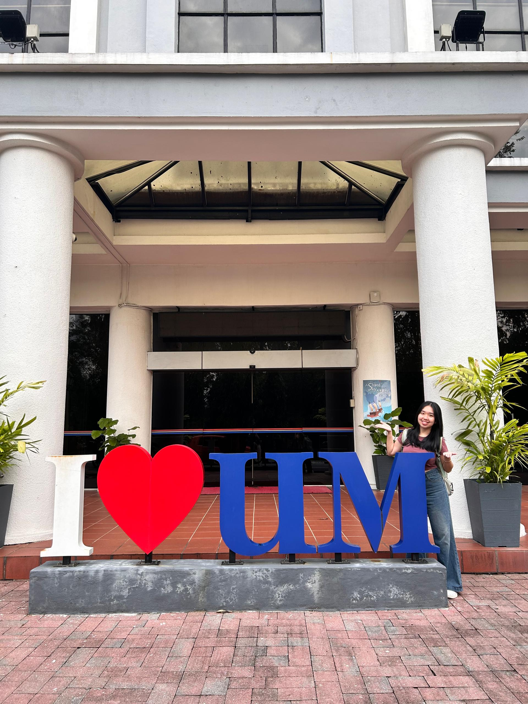

# Introduction
Hi! 😆 I'm Yan Jie, a student in the Software Maintenance and Evolution course. 
I expect to learn how to keep software working well and improve it over time in this course.

I enjoy connecting with people from different cultures, love creating things that tell a story, and believe tech should always make life a little brighter ✨

  <!-- Link to the uploaded image -->

## GitHub Profile

You can view my personalized GitHub profile here, https://github.com/Yanjie0910

✨Always happy to meet new people, learn something new, or just share ideas over a good chat.
